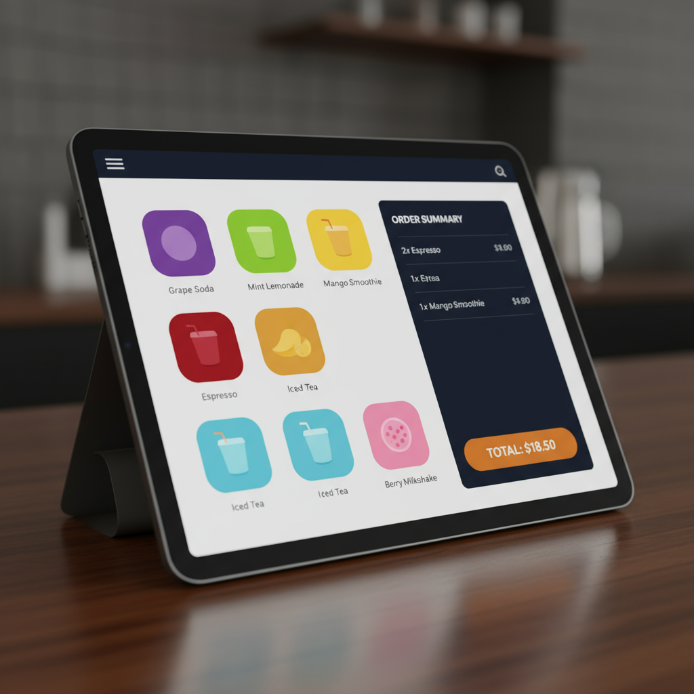

# Lux Mart - Convenience Store POS System

A modern, professional Point-of-Sale (POS) system designed specifically for convenience stores, featuring comprehensive inventory management, real-time sales analytics, and an intuitive touch-friendly interface.


## 📋 Table of Contents
- [Overview](#overview)
- [Features](#features)
- [Design Philosophy](#design-philosophy)
- [User Interactions](#user-interactions)
- [Technology Stack](#technology-stack)
- [Installation](#installation)
- [Usage Guide](#usage-guide)
- [Project Structure](#project-structure)
- [Screenshots](#screenshots)
- [Keyboard Shortcuts](#keyboard-shortcuts)
- [Contributing](#contributing)
- [License](#license)

---

## 🎯 Overview

Lux Mart is a full-featured convenience store management system that streamlines retail operations from inventory tracking to sales analytics. Built with modern web technologies and optimized for both desktop and touchscreen POS systems, it provides an intuitive interface for cashiers and powerful tools for store managers.

### Why Lux Mart?

- **Fast Checkout**: Optimized for quick transactions with minimal clicks
- **Real-time Inventory**: Automatic stock updates after each sale
- **Professional Reports**: Comprehensive analytics for business insights
- **Offline Capable**: Works seamlessly even without internet connection
- **Touch-Optimized**: Perfect for modern touchscreen POS terminals

---

## ✨ Features

### 🛒 Main POS Interface
- **Product Categories**: Quick-filter buttons for Beverages, Snacks, Tobacco, Lottery, etc.
- **Visual Product Catalog**: Grid view with images, names, and prices
- **Live Shopping Cart**: Real-time updates with running totals
- **Multiple Payment Methods**: Cash, Card, and Digital payments
- **Quick Actions**: Clear Cart, Apply Discount, Process Payment, Print Receipt
- **Smart Search**: Real-time product search with autocomplete

### 📦 Inventory Management
- **Visual Product Grid**: Complete catalog with stock level indicators
- **Easy Product Management**: Add/Edit products with intuitive modal forms
- **Stock Alerts**: Visual warnings for low-stock items
- **Barcode Integration**: Scanner support for quick product addition
- **Bulk Operations**: Import/export functionality for efficient updates
- **Category Organization**: Organize products by type for easy navigation

### 📊 Sales Analytics Dashboard
- **Revenue Charts**: Daily, weekly, and monthly sales visualization
- **Product Performance**: Track top-selling items and profit margins
- **Transaction History**: Searchable record of all sales
- **Inventory Reports**: Stock levels and reorder alerts
- **Profit Analysis**: Revenue vs cost breakdown
- **Custom Date Ranges**: Filter data for specific time periods

### 🧾 Receipt Management
- **Transaction Search**: Find receipts by date, amount, or product
- **Detailed Receipt View**: Complete transaction information
- **Receipt Reprint**: Generate duplicate receipts on demand
- **Refund Processing**: Handle returns and exchanges
- **Daily Reports**: End-of-day summary and closing reports
- **Export Options**: Save reports in various formats

### 🔄 Real-time Features
- Instant cart updates when products are added/removed
- Automatic stock level adjustments after sales
- Live sales dashboard with current metrics
- Offline data sync when connection restored

---

## 🎨 Design Philosophy

### Visual Identity

Our design prioritizes **efficiency, professionalism, and clarity** - essential qualities for a high-traffic retail environment.

#### Color Palette
- **Primary - Deep Navy** (`#1a2332`): Professional, trustworthy, retail-appropriate
- **Secondary - Warm Orange** (`#ff6b35`): Energy, urgency, call-to-action highlights
- **Accent - Light Gray** (`#f8f9fa`): Clean backgrounds, subtle separators
- **Success - Forest Green** (`#28a745`): Positive actions, completed transactions
- **Warning - Amber** (`#ffc107`): Alerts, low stock warnings
- **Error - Coral Red** (`#dc3545`): Errors, critical alerts

#### Typography
- **Display & Body**: **Inter** - Modern, clean sans-serif for excellent readability
- **Monospace**: **JetBrains Mono** - For pricing, quantities, and numerical data

### Design Principles

#### Minimalist Efficiency
Clean, uncluttered interface optimized for quick transactions. Every element serves a purpose, reducing cognitive load for cashiers during busy periods.

#### Retail Professionalism
Trustworthy design that instills confidence in business operations. Professional appearance suitable for customer-facing environments.

#### Touch-Friendly
Large buttons and interactive elements designed for touchscreen POS systems. Generous tap targets (minimum 44x44px) ensure accuracy.

#### Data-Driven
Clear hierarchy and visual organization for complex information. Important metrics highlighted, secondary data accessible but not intrusive.

### Visual Effects & Styling

#### Animation Libraries
- **Anime.js**: Smooth micro-interactions for button presses, cart updates, and form transitions
- **ECharts.js**: Professional, interactive data visualization for sales analytics
- **Splide.js**: Product image carousels and promotional banners
- **p5.js**: Dynamic background patterns and elegant loading animations
- **Matter.js**: Subtle physics effects for drag-and-drop inventory management

#### Interactive Elements
- **Micro-interactions**: Subtle hover states and click feedback
- **Loading States**: Elegant animations during data processing
- **Notification System**: Toast notifications for confirmations and alerts
- **Modal Dialogs**: Professional overlays for forms and detailed information

#### Layout System
- **12-Column Grid**: Consistent grid system across all layouts
- **Responsive Design**: Mobile-first approach with tablet and desktop breakpoints
- **Information Hierarchy**: Clear visual hierarchy with proper spacing
- **Accessibility**: High contrast ratios (WCAG 2.1 AA compliant) and keyboard navigation

#### Professional Touches
- **Elevation Shadows**: Consistent shadow system for depth and layering
- **Border Radius**: Subtle rounded corners (4px-8px) for modern appearance
- **Icon System**: Consistent iconography using Feather icons
- **Color Coding**: Intuitive system for product categories and status indicators

---

## 🖱️ User Interactions

### Core Interaction Components

#### 1. Main POS Interface (Primary Sales Screen)

**Location**: Index page  
**Primary Use**: Fast checkout and transaction processing

**Layout**:
- **Left Panel**: Product category filters (Beverages, Snacks, Tobacco, Lottery, etc.)
- **Center Grid**: Product catalog with images, names, prices, and quantity selectors
- **Right Panel**: Live shopping cart with itemized list, calculations, and payment options
- **Bottom Bar**: Quick action buttons (Clear Cart, Apply Discount, Process Payment, Print Receipt)
- **Top Bar**: Real-time product search with autocomplete suggestions

**User Flow**:
```
1. Cashier selects product category OR uses search bar
   ↓
2. Clicks product to add to cart (default quantity: 1)
   ↓
3. Adjusts quantity if needed (+ / - buttons)
   ↓
4. Cart updates in real-time with running total
   ↓
5. Selects payment method (Cash / Card / Digital)
   ↓
6. Clicks "Process Payment"
   ↓
7. Receipt generated and printed/emailed
```

#### 2. Inventory Management System

**Location**: Dedicated inventory page  
**Primary Use**: Product catalog management and stock control

**Features**:
- Visual product grid with current stock levels
- Color-coded stock alerts (green: healthy, yellow: low, red: critical)
- Add/Edit product modal with comprehensive form
- Barcode scanner integration
- Bulk import/export functionality

**User Flow**:
```
1. View all products in grid layout
   ↓
2. Stock levels visible at a glance
   ↓
3. Click "Add Product" button
   ↓
4. Fill modal form:
   - Product name
   - Category selection
   - Retail price & cost
   - Barcode (manual or scan)
   - Initial stock quantity
   - Product image (optional)
   ↓
5. Save product → appears in catalog immediately
   ↓
6. Edit existing products by clicking on them
```

#### 3. Sales Analytics Dashboard

**Location**: Analytics page  
**Primary Use**: Business insights and performance tracking

**Components**:
- **Revenue Charts**: Interactive line/bar charts with date range filters
- **Product Performance**: Top sellers, profit margins, category breakdown
- **Transaction History**: Searchable/sortable table of all sales
- **Inventory Reports**: Current stock levels, reorder alerts
- **Profit Analysis**: Revenue vs cost with margin calculations

**User Flow**:
```
1. Open analytics dashboard
   ↓
2. View key metrics (today's sales, weekly revenue, top products)
   ↓
3. Apply filters (date range, category, product)
   ↓
4. Click chart elements to drill down into specific data
   ↓
5. Export reports (PDF, CSV, Excel)
```

#### 4. Receipt Management System

**Location**: Transactions page  
**Primary Use**: Transaction lookup and refund processing

**Functionality**:
- Advanced search (by date, amount, product, customer)
- Detailed receipt viewer
- One-click receipt reprint
- Refund/exchange processing
- Daily closing reports

**User Flow**:
```
1. Enter search criteria (date, amount, etc.)
   ↓
2. Browse results in table view
   ↓
3. Click transaction to view full receipt details
   ↓
4. Options:
   - Reprint receipt
   - Process refund/exchange
   - Add notes
   - Email receipt
```

### Interactive Features

#### Real-time Updates
- Shopping cart updates instantly (no page refresh)
- Stock levels adjust automatically after each sale
- Sales dashboard refreshes with live data every 30 seconds
- Low-stock alerts appear immediately when thresholds reached

#### Touch-Friendly Design
- **Large Tap Targets**: All buttons minimum 44x44px
- **Swipe Gestures**: Swipe to remove items from cart
- **Pinch-to-Zoom**: Product image zoom capability
- **Drag-and-Drop**: Reorder product categories
- **Pull-to-Refresh**: Update data with natural gesture

#### Error Handling
- **Form Validation**: Real-time validation with helpful error messages
- **Stock Checks**: Prevent overselling with instant stock verification
- **Payment Feedback**: Clear success/failure indicators
- **Network Alerts**: Offline mode notification with data sync status
- **Recovery Options**: Auto-save draft transactions

#### Data Persistence
- **Local Storage**: All transactions cached for offline access
- **Auto-Backup**: Periodic backup to prevent data loss
- **Sync on Reconnect**: Automatic sync when internet restored
- **Settings Memory**: User preferences saved across sessions

---

## 🛠️ Technology Stack

### Frontend Technologies
- **HTML5**: Semantic markup with accessibility features
- **CSS3**: Modern styling with Flexbox, Grid, and custom properties
- **JavaScript (ES6+)**: Vanilla JS for optimal performance
- **No Framework Dependencies**: Lightweight, fast, no bloat

### Animation & Visualization
- **Anime.js** (`v3.2.1`): Smooth micro-interactions
- **ECharts.js** (`v5.4.0`): Professional data visualization
- **Splide.js** (`v4.1.3`): Image carousels
- **p5.js** (`v1.6.0`): Dynamic backgrounds
- **Matter.js** (`v0.19.0`): Physics-based interactions

### Storage & Performance
- **LocalStorage API**: Client-side data persistence
- **IndexedDB**: Large dataset storage
- **Service Workers**: Offline capability (Progressive Web App)
- **Lazy Loading**: Optimized image loading

### Print & Export
- **jsPDF**: PDF generation for reports and receipts
- **Print.js**: Enhanced print functionality
- **Papa Parse**: CSV export/import

---

## 📦 Installation

### Prerequisites
- Modern web browser (Chrome 90+, Firefox 88+, Safari 14+, Edge 90+)
- Web server (for local development)

### Quick Start

#### Option 1: Clone from GitHub
```bash
# Clone the repository
git clone https://github.com/Oluwataye/lux-mart.git

# Navigate to project directory
cd lux-mart

# Open with local server
# Using Python 3
python -m http.server 8000

# OR using Node.js
npx http-server -p 8000

# OR using PHP
php -S localhost:8000
```

#### Option 2: Direct Download
1. Download ZIP from [GitHub repository](https://github.com/Oluwataye/lux-mart)
2. Extract to your desired location
3. Open `index.html` in your browser

#### Option 3: VS Code Live Server
1. Open project folder in VS Code
2. Install "Live Server" extension
3. Right-click `index.html` → "Open with Live Server"

### Access the Application
```
http://localhost:8000
```

### Default Login Credentials

**Manager Account** (Full Access):
- Username: `admin`
- Password: `admin123`

**Cashier Account** (Sales Only):
- Username: `cashier`
- Password: `cashier123`

⚠️ **Security Note**: Change default passwords immediately in production!

---

## 🚀 Usage Guide

### For Cashiers

#### Processing a Sale
1. **Login** with cashier credentials
2. **Find Products**:
   - Click category buttons (left panel)
   - OR use search bar for quick lookup
3. **Build Cart**:
   - Click products to add (default quantity: 1)
   - Adjust quantities with +/- buttons
   - Remove items by clicking X
4. **Apply Discounts** (if authorized):
   - Click "Apply Discount" button
   - Enter percentage or fixed amount
5. **Process Payment**:
   - Select payment method (Cash/Card/Digital)
   - Enter amount received (for cash)
   - Click "Complete Sale"
6. **Print Receipt**:
   - Receipt generates automatically
   - Print or email to customer

#### Daily Operations
- **Start of Day**: Review opening stock levels
- **During Shift**: Monitor low-stock alerts
- **End of Shift**: Generate shift report
- **Close Out**: Print daily summary

### For Managers/Administrators

#### Inventory Management
1. **Navigate** to Inventory page
2. **Add New Product**:
   - Click "Add Product" button
   - Fill all required fields:
     - Product name
     - Category
     - Retail price
     - Cost price
     - Barcode (optional)
     - Initial stock
     - Product image (optional)
   - Click "Save Product"
3. **Update Existing Product**:
   - Click on product card
   - Modify fields
   - Save changes
4. **Bulk Operations**:
   - Export current inventory (CSV)
   - Prepare updated file
   - Import back to system

#### Analyzing Sales Data
1. **Open Analytics Dashboard**
2. **Review Key Metrics**:
   - Today's revenue
   - Week-to-date sales
   - Month-to-date performance
   - Top-selling products
3. **Filter Data**:
   - Select date range
   - Choose specific categories
   - Filter by product
4. **Generate Reports**:
   - Click "Export Report"
   - Select format (PDF/CSV)
   - Download and share

#### Managing Transactions
1. **Search Receipts**:
   - Enter date range
   - Filter by amount or product
2. **Process Refunds**:
   - Find original transaction
   - Click "Process Refund"
   - Enter reason and authorization
   - Complete refund

---

## 📁 Project Structure

```
lux-mart/
├── index.html                 # Landing/POS page
├── login.html                 # Authentication page
├── admin-dashboard.html       # Manager dashboard
├── inventory.html             # Product management
├── transactions.html          # Receipt history
├── analytics.html             # Sales analytics
│
├── css/
│   ├── main.css              # Global styles
│   ├── pos.css               # POS interface styles
│   └── admin.css             # Admin panel styles
│
├── js/
│   ├── login.js              # Authentication logic
│   ├── main.js               # Shared utilities
│   ├── pos.js                # POS system logic
│   ├── admin-dashboard.js    # Dashboard functionality
│   ├── inventory.js          # Inventory operations
│   ├── transactions.js       # Transaction management
│   └── analytics.js          # Charts and analytics
│
├── resources/
│   ├── images/               # Product images
│   ├── icons/                # UI icons
│   ├── hero-store.png        # Landing page hero
│   ├── pos-interface.png     # POS screenshot
│   └── analytics-dashboard.png
│
├── data/
│   ├── products.json         # Sample product data
│   └── categories.json       # Product categories
│
├── docs/
│   ├── design.md            # Design documentation
│   ├── interaction.md       # Interaction flows
│   └── outline.md           # System architecture
│
├── .gitignore               # Git ignore rules
├── README.md                # This file
└── LICENSE                  # MIT License

```

### Key Files Explained

- **index.html**: Main POS interface for cashiers
- **login.html**: Secure authentication with role-based access
- **admin-dashboard.html**: Overview dashboard for managers
- **inventory.html**: Complete product catalog management
- **transactions.html**: Transaction history and refund processing
- **analytics.html**: Sales analytics and reporting

---

## 📸 Screenshots

### POS Interface

*Clean, efficient checkout interface optimized for speed*

### Analytics Dashboard

*Comprehensive sales insights with interactive charts*

### Inventory Management
*Visual product grid with stock level indicators*

---

## ⌨️ Keyboard Shortcuts

Boost productivity with these keyboard shortcuts:

| Shortcut | Action |
|----------|--------|
| `F1` | Start new transaction |
| `F2` | Focus search bar |
| `F3` | Process payment |
| `F4` | Print last receipt |
| `F5` | Refresh data |
| `ESC` | Cancel current operation |
| `Ctrl + S` | Quick save (inventory) |
| `Ctrl + P` | Print current view |
| `Ctrl + F` | Advanced search |
| `Alt + N` | Add new product |

---

## 🤝 Contributing

We welcome contributions! Here's how you can help:

### Getting Started
1. **Fork** the repository
2. **Create** a feature branch:
   ```bash
   git checkout -b feature/AmazingFeature
   ```
3. **Commit** your changes:
   ```bash
   git commit -m 'Add some AmazingFeature'
   ```
4. **Push** to your branch:
   ```bash
   git push origin feature/AmazingFeature
   ```
5. **Open** a Pull Request

### Contribution Guidelines
- Follow existing code style and conventions
- Write clear commit messages
- Add comments for complex logic
- Update documentation for new features
- Test thoroughly before submitting

### Areas for Contribution
- 🐛 Bug fixes and error handling
- ✨ New features and enhancements
- 📝 Documentation improvements
- 🎨 UI/UX enhancements
- ♿ Accessibility improvements
- 🌍 Internationalization (i18n)

---

## 📄 License

This project is licensed under the **MIT License**.

```
MIT License

Copyright (c) 2024 Taye David Ibuku

Permission is hereby granted, free of charge, to any person obtaining a copy
of this software and associated documentation files (the "Software"), to deal
in the Software without restriction, including without limitation the rights
to use, copy, modify, merge, publish, distribute, sublicense, and/or sell
copies of the Software, and to permit persons to whom the Software is
furnished to do so, subject to the following conditions:

The above copyright notice and this permission notice shall be included in all
copies or substantial portions of the Software.

THE SOFTWARE IS PROVIDED "AS IS", WITHOUT WARRANTY OF ANY KIND, EXPRESS OR
IMPLIED, INCLUDING BUT NOT LIMITED TO THE WARRANTIES OF MERCHANTABILITY,
FITNESS FOR A PARTICULAR PURPOSE AND NONINFRINGEMENT. IN NO EVENT SHALL THE
AUTHORS OR COPYRIGHT HOLDERS BE LIABLE FOR ANY CLAIM, DAMAGES OR OTHER
LIABILITY, WHETHER IN AN ACTION OF CONTRACT, TORT OR OTHERWISE, ARISING FROM,
OUT OF OR IN CONNECTION WITH THE SOFTWARE OR THE USE OR OTHER DEALINGS IN THE
SOFTWARE.
```

---

## 👤 Author

**Taye David Ibuku**

- 🐙 GitHub: [@Oluwataye](https://github.com/Oluwataye)
- 📧 Email: davidtayeibukunoni@gmail.com
- 💼 LinkedIn: [Connect with me](https://linkedin.com/in/taye-david-ibuku)

---

## 🙏 Acknowledgments

### Technologies & Libraries
- [Anime.js](https://animejs.com/) - Animation engine
- [ECharts](https://echarts.apache.org/) - Data visualization
- [Splide.js](https://splidejs.com/) - Carousel slider
- [p5.js](https://p5js.org/) - Creative coding
- [Matter.js](https://brm.io/matter-js/) - Physics engine
- [Feather Icons](https://feathericons.com/) - Icon set
- [Inter Font](https://rsms.me/inter/) - Typography

### Inspiration
- Modern retail POS systems
- E-commerce checkout flows
- Dashboard design patterns from leading SaaS products

### Special Thanks
- Open source community for excellent tools and libraries
- Beta testers who provided valuable feedback
- Store managers who shared real-world requirements

---

## 📞 Support

### Need Help?

- 📖 **Documentation**: Check our [Wiki](https://github.com/Oluwataye/lux-mart/wiki)
- 🐛 **Bug Reports**: [Open an issue](https://github.com/Oluwataye/lux-mart/issues)
- 💬 **Discussions**: [Join the conversation](https://github.com/Oluwataye/lux-mart/discussions)
- 📧 **Email**: davidtayeibukunoni@gmail.com

### Frequently Asked Questions

**Q: Can I use this for my actual store?**  
A: Yes! This is production-ready software under MIT license.

**Q: Does it work offline?**  
A: Yes, it caches data locally and syncs when reconnected.

**Q: Can I customize the design?**  
A: Absolutely! All CSS is well-organized and documented.

**Q: Is there a mobile app?**  
A: It's a Progressive Web App (PWA) - install it like a native app!

**Q: How do I reset the demo data?**  
A: Clear browser localStorage or click "Reset Demo" in settings.

---

## 🗺️ Roadmap

### Version 2.0 (Planned)
- [ ] Multi-store support
- [ ] Customer loyalty program
- [ ] Employee time tracking
- [ ] Advanced reporting (profit/loss, tax reports)
- [ ] Barcode label printing
- [ ] Supplier management
- [ ] Purchase order system

### Version 2.5 (Future)
- [ ] Mobile app (React Native)
- [ ] Cloud sync and backup
- [ ] Multi-language support
- [ ] Advanced analytics (predictive insights)
- [ ] Integration with accounting software
- [ ] Gift card management

---

## 📊 Project Stats


---

<div align="center">

### ⭐ Star this repo if you find it helpful!

**Made with ❤️ for convenience store owners everywhere**

[Report Bug](https://github.com/Oluwataye/lux-mart/issues) · [Request Feature](https://github.com/Oluwataye/lux-mart/issues) · [Documentation](https://github.com/Oluwataye/lux-mart/wiki)

</div>
